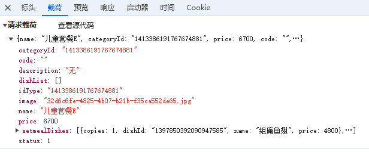

# 瑞吉外卖
1. day6前端文件里main.js第一行ajax请求没有加data，所以在把 cartListApi中的注释改掉之后显示不出分类信息
2. 
>divCartContent
    >divCartItem
        >divNum
            >divDishNum
把font-size改一改

front/index.html下134行
<div class="divDishNum">{{item.number}}</div>
加上style="font-size:16px"
即
<div class="divDishNum" style="font-size:16px">{{item.number}}</div>

3.
redis.windows.conf文件修改
注释掉bind 127.0.0.1
声明port 6379
声明requirepass 123456

## 逻辑
去结算跳转到/front/page/add-order.html
结果直接跳到了address-edit.html
为什么？
因为没有默认地址
```javascript
//获取默认地址
async defaultAddress(){
    const res = await  getDefaultAddressApi()
    if(res.code === 1){
        this.address = res.data
        this.getFinishTime()
    }else{
        window.requestAnimationFrame(()=>{
            window.location.href = '/front/page/address-edit.html'
        })
    }
},
```

## 关于注解
@RequestMapping用来声明
网页请求映射
可用于类（通常）和方法
@RequestBody用来绑定网页发送的JSON数据到一个java对象(map也可)
```java
@PostMapping("/login")
public R<User> login(@RequestBody Map map, HttpSession session)
```
@PathVariable用来将URI中的值注入到方法参数中
@Get/Post/DeleteMapping等是
    @RequestMapping(method=RequestMethod.GET/POST/DELETE)
的shortcut
@RequestParam
```java
@GetMapping("/users")
public String getUsers(@RequestParam("name") String userName) {
    // method implementation
}

@GetMapping("/users")
public String getUsers(@RequestParam(value = "name", required = false, defaultValue = "John Doe") String userName) {
    // method implementation
}
```

## 关于传参形式


### Sample1
前端：
请求：http://localhost:8080/order/userPage?page=1&pageSize=1
后端：ordercontroller中声明@RequestMapping("/order")

### Sample2(斜杠传参)backend菜品管理修改菜品时
前端：
```javascript
statusHandle (row) {
    let params = {}
    if (typeof row === 'string' ) {
        if (this.checkList.length === 0) {
        this.$message.error('批量操作，请先勾选操作菜品！')
        return false
        }
        params.id = this.checkList.join(',')
        params.status = row
    } else {
        params.id = row.id
        params.status = row.status ? '0' : '1'
    }
    this.dishState = params
    this.$confirm('确认更改该菜品状态?', '提示', {
        'confirmButtonText': '确定',
        'cancelButtonText': '取消',
        'type': 'warning'
    }).then(() => {
        // 起售停售---批量起售停售接口
        dishStatusByStatus(this.dishState).then(res => {
        if (res.code === 1) {
            this.$message.success('菜品状态已经更改成功！')
            this.handleQuery()
        } else {
            this.$message.error(res.msg || '操作失败')
        }
        }).catch(err => {
            this.$message.error('请求出错了：' + err)
        })
    })
},
```

请求：http://localhost:8080/dish/1413384757047271425
后端：
其中dishcontroller已声明("/dish")
需要声明PathVariable用于接收直接传参
```java
@GetMapping("/{id}")
    public R<DishDto> get(@PathVariable Long id)
```

### Sample3(多个参数)
前端：
请求：
后端：
声明RequestParam
```java
@DeleteMapping
    public R<String> delete(@RequestParam List<Long> ids)
```

### Sample4(JSON传参)新增套餐时(通常使用实体类接收)

前端：
```javascript
<el-button type="primary" @click="submitForm('ruleForm', false)"> 保存 </el-button>

    submitForm(formName, st) {
    this.$refs[formName].validate((valid) => {
        if (valid) {
        let prams = { ...this.ruleForm }
        prams.price *= 100
        prams.setmealDishes = this.dishTable.map((obj) => ({
            copies: obj.copies,
            dishId: obj.dishId,
            name: obj.name,
            price: obj.price,
        }))
        prams.status = this.ruleForm ? 1 : 0
        prams.categoryId = this.ruleForm.idType
        if(prams.setmealDishes.length < 1){
            this.$message.error('请选择菜品！')
            return 
        }
        if(!this.imageUrl){
            this.$message.error('请上传套餐图片')
            return 
        }
        // delete prams.dishList
        if (this.actionType == 'add') {
            delete prams.id
            addSetmeal(prams)
            .then((res) => {
                if (res.code === 1) {
                this.$message.success('套餐添加成功！')
                if (!st) {
                    this.goBack()
                } else {
                    this.$refs.ruleForm.resetFields()
                    this.dishList = []
                    this.dishTable = []
                    this.ruleForm = {
                    name: '',
                    categoryId: '',
                    price: '',
                    code: '',
                    image: '',
                    description: '',
                    dishList: [],
                    status: true,
                    id: '',
                    idType: '',
                    }
                    this.imageUrl = ''
                }
                } else {
                this.$message.error(res.msg || '操作失败')
                }
            })
            .catch((err) => {
                this.$message.error('请求出错了：' + err)
            })
        } else {
            delete prams.updateTime
            editSetmeal(prams)
            .then((res) => {
                if (res.code === 1) {
                this.$message.success('套餐修改成功！')
                this.goBack()
                } else {
                this.$message.error(res.msg || '操作失败')
                }
            })
            .catch((err) => {
                this.$message.error('请求出错了：' + err)
            })
        }
        } else {
        return false
        }
    })
},
```
请求：http://localhost:8080/setmeal（含载荷JSON）

后端：
其中setmealcontroller已声明("/setmeal")
需要声明RequestBody用于接收JSON数据
```java
@PostMapping
    public R<String> save(@RequestBody SetmealDto setmealDto)
```

### Sample5(直接取值赋值)backend点击菜品管理时
前端：
请求：http://localhost:8080/dish/page?page=1&pageSize=10
（载荷中也可以看到page：1   pageSize：10）
java程序断点处发现page pageSize都成功赋上了值，name为null
后端：
```java
@GetMapping("/page")
    public R<Page> page(int page, int pageSize, String name)
```